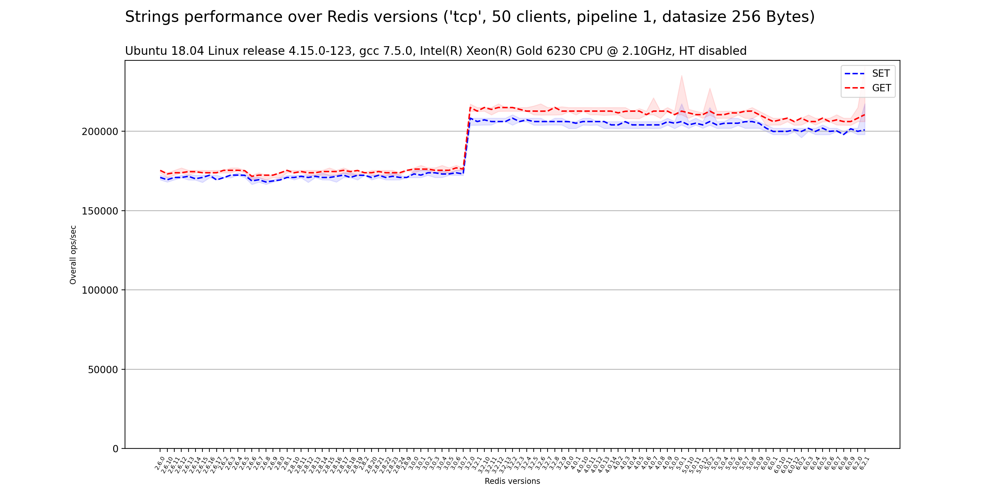
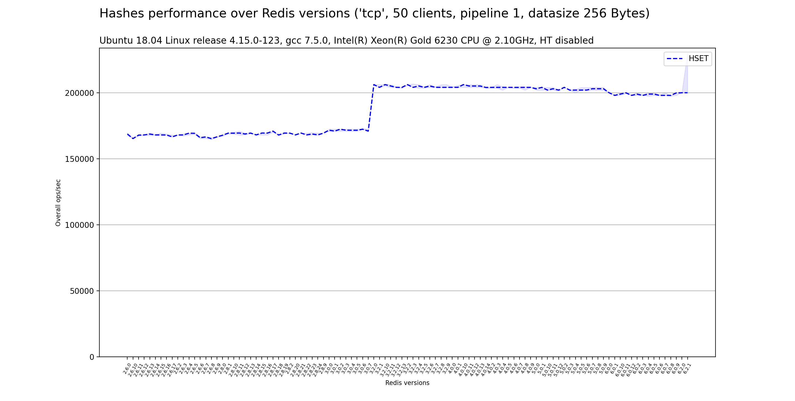
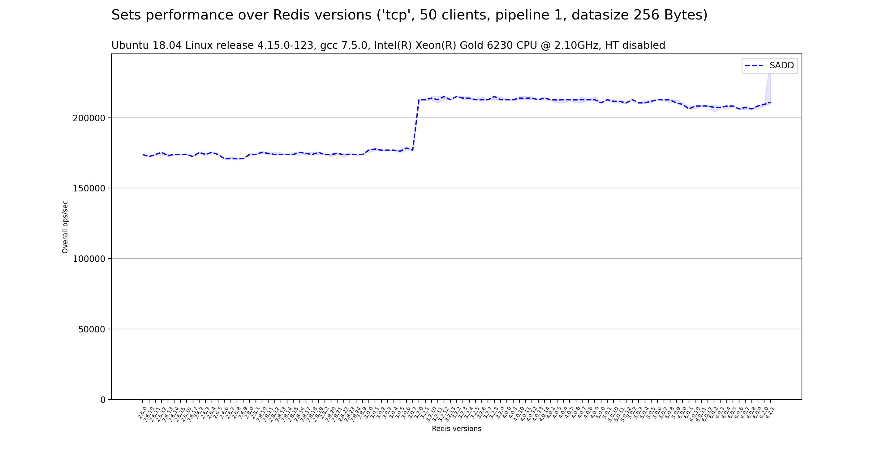
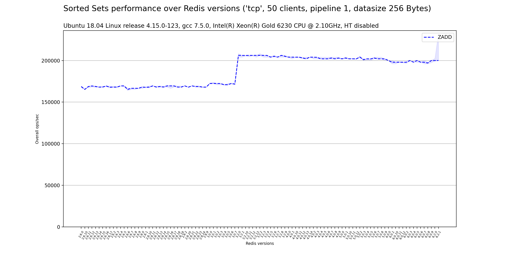

# How fast is Redis?

Redis includes the `redis-benchmark` utility that simulates running commands done
by N clients at the same time sending M total queries (it is similar to the
Apache's `ab` utility). Below you'll find the full output of a benchmark executed
against a Linux box.

The following options are supported:

    Usage: redis-benchmark [-h <host>] [-p <port>] [-c <clients>] [-n <requests]> [-k <boolean>]

     -h <hostname>      Server hostname (default 127.0.0.1)
     -p <port>          Server port (default 6379)
     -s <socket>        Server socket (overrides host and port)
     -a <password>      Password for Redis Auth
     --user <username>  Used to send ACL style 'AUTH username pass'. Needs -a.
     -c <clients>       Number of parallel connections (default 50)
     -n <requests>      Total number of requests (default 100000)
     -d <size>          Data size of SET/GET value in bytes (default 3)
     --dbnum <db>       SELECT the specified db number (default 0)
     --threads <num>    Enable multi-thread mode.
     --cluster          Enable cluster mode.
     --enable-tracking  Send CLIENT TRACKING on before starting benchmark.
     -k <boolean>       1=keep alive 0=reconnect (default 1)
     -r <keyspacelen>    Use random keys for SET/GET/INCR, random values for
                         SADD, random members and scores for ZADD.
                         Using this option the benchmark will expand the string
                         __rand_int__ inside an argument with a 12 digits number
                         in the specified range from 0 to keyspacelen-1. The
                         substitution changes every time a command is executed.
                         Default tests use this to hit random keys in the
                         specified range.
     -P <numreq>        Pipeline <numreq> requests. Default 1 (no pipeline).
     -e                 If server replies with errors, show them on stdout.
                        (No more than 1 error per second is displayed.)
     -q                 Quiet. Just show query/sec values
     --precision        Number of decimal places to display in latency output (default 0)
     --csv              Output in CSV format
     -l                 Loop. Run the tests forever
     -t <tests>         Only run the comma separated list of tests. The test
                        names are the same as the ones produced as output.
     -I                 Idle mode. Just open N idle connections and wait.
     --help             Output this help and exit.
     --version          Output version and exit.

You need to have a running Redis instance before launching the benchmark.
A typical example would be:

    redis-benchmark -q -n 100000

Using this tool is quite easy, and you can also write your own benchmark,
but as with any benchmarking activity, there are some pitfalls to avoid.

Running only a subset of the tests
---

You don't need to run all the default tests every time you execute redis-benchmark.
The simplest thing to select only a subset of tests is to use the `-t` option
like in the following example:

    $ redis-benchmark -t set,lpush -n 100000 -q
    SET: 180180.17 requests per second, p50=0.143 msec                    
    LPUSH: 188323.91 requests per second, p50=0.135 msec

In the above example we asked to just run test the SET and LPUSH commands,
in quiet mode (see the `-q` switch).

It is also possible to specify the command to benchmark directly like in the
following example:

    $ redis-benchmark -n 100000 -q script load "redis.call('set','foo','bar')"
    script load redis.call('set','foo','bar'): 69881.20 requests per second

Selecting the size of the key space
---

By default the benchmark runs against a single key. In Redis the difference
between such a synthetic benchmark and a real one is not huge since it is an
in-memory system, however it is possible to stress cache misses and in general
to simulate a more real-world work load by using a large key space.

This is obtained by using the `-r` switch. For instance if I want to run
one million SET operations, using a random key for every operation out of
100k possible keys, I'll use the following command line:

    $ redis-cli flushall
    OK

    $ redis-benchmark -t set -r 100000 -n 1000000
    ====== SET ======
      1000000 requests completed in 13.86 seconds
      50 parallel clients
      3 bytes payload
      keep alive: 1

    99.76% `<=` 1 milliseconds
    99.98% `<=` 2 milliseconds
    100.00% `<=` 3 milliseconds
    100.00% `<=` 3 milliseconds
    72144.87 requests per second

    $ redis-cli dbsize
    (integer) 99993

Using pipelining
---

By default every client (the benchmark simulates 50 clients if not otherwise
specified with `-c`) sends the next command only when the reply of the previous
command is received, this means that the server will likely need a read call
in order to read each command from every client. Also RTT is paid as well.

Redis supports [pipelining](/topics/pipelining), so it is possible to send
multiple commands at once, a feature often exploited by real world applications.
Redis pipelining is able to dramatically improve the number of operations per
second a server is able do deliver.

This is an example of running the benchmark in a MacBook Air 11" using a
pipelining of 16 commands:

    $ redis-benchmark -n 1000000 -t set,get -P 16 -q
    SET: 1536098.25 requests per second, p50=0.479 msec                     
    GET: 1811594.25 requests per second, p50=0.391 msec

Using pipelining results in a significant increase in performance.

Pitfalls and misconceptions
---------------------------

The first point is obvious: the golden rule of a useful benchmark is to
only compare apples and apples. Different versions of Redis can be compared
on the same workload for instance. Or the same version of Redis, but with
different options. If you plan to compare Redis to something else, then it is
important to evaluate the functional and technical differences, and take them
in account.

+ Redis is a server: all commands involve network or IPC round trips. It is meaningless to compare it to embedded data stores such as SQLite, Berkeley DB, Tokyo/Kyoto Cabinet, etc ... because the cost of most operations is primarily in network/protocol management.
+ Redis commands return an acknowledgment for all usual commands. Some other data stores do not. Comparing Redis to stores involving one-way queries is only mildly useful.
+ Naively iterating on synchronous Redis commands does not benchmark Redis itself, but rather measure your network (or IPC) latency and the client library intrinsic latency. To really test Redis, you need multiple connections (like redis-benchmark) and/or to use pipelining to aggregate several commands and/or multiple threads or processes.
+ Redis is an in-memory data store with some optional persistence options. If you plan to compare it to transactional servers (MySQL, PostgreSQL, etc ...), then you should consider activating AOF and decide on a suitable fsync policy.
+ Redis is, mostly, a single-threaded server from the POV of commands execution (actually modern versions of Redis use threads for different things). It is not designed to benefit from multiple CPU cores. People are supposed to launch several Redis instances to scale out on several cores if needed. It is not really fair to compare one single Redis instance to a multi-threaded data store.

A common misconception is that redis-benchmark is designed to make Redis
performances look stellar, the throughput achieved by redis-benchmark being
somewhat artificial, and not achievable by a real application. This is
actually not true.

The `redis-benchmark` program is a quick and useful way to get some figures and
evaluate the performance of a Redis instance on a given hardware. However,
by default, it does not represent the maximum throughput a Redis instance can
sustain. Actually, by using pipelining and a fast client (hiredis), it is fairly
easy to write a program generating more throughput than redis-benchmark. The
default behavior of redis-benchmark is to achieve throughput by exploiting
concurrency only (i.e. it creates several connections to the server).
It does not use pipelining or any parallelism at all (one pending query per
connection at most, and no multi-threading), if not explicitly enabled via
the `-P` parameter. So in some way using `redis-benchmark` and, triggering, for
example, a `BGSAVE` operation in the background at the same time, will provide
the user with numbers more near to the *worst case* than to the best case.

To run a benchmark using pipelining mode (and achieve higher throughput),
you need to explicitly use the -P option. Please note that it is still a
realistic behavior since a lot of Redis based applications actively use
pipelining to improve performance. However you should use a pipeline size that
is more or less the average pipeline length you'll be able to use in your
application in order to get realistic numbers.

Finally, the benchmark should apply the same operations, and work in the same way
with the multiple data stores you want to compare. It is absolutely pointless to
compare the result of redis-benchmark to the result of another benchmark
program and extrapolate.

For instance, Redis and memcached in single-threaded mode can be compared on
GET/SET operations. Both are in-memory data stores, working mostly in the same
way at the protocol level. Provided their respective benchmark application is
aggregating queries in the same way (pipelining) and use a similar number of
connections, the comparison is actually meaningful.

This perfect example is illustrated by the dialog between Redis (antirez) and
memcached (dormando) developers.

[antirez 1 - On Redis, Memcached, Speed, Benchmarks and The Toilet](http://antirez.com/post/redis-memcached-benchmark.html)

[dormando - Redis VS Memcached (slightly better bench)](http://dormando.livejournal.com/525147.html)

[antirez 2 - An update on the Memcached/Redis benchmark](http://antirez.com/post/update-on-memcached-redis-benchmark.html)

You can see that in the end, the difference between the two solutions is not
so staggering, once all technical aspects are considered. Please note both
Redis and memcached have been optimized further after these benchmarks.

Finally, when very efficient servers are benchmarked (and stores like Redis
or memcached definitely fall in this category), it may be difficult to saturate
the server. Sometimes, the performance bottleneck is on client side,
and not server-side. In that case, the client (i.e. the benchmark program itself)
must be fixed, or perhaps scaled out, in order to reach the maximum throughput.

Factors impacting Redis performance
-----------------------------------

There are multiple factors having direct consequences on Redis performance.
We mention them here, since they can alter the result of any benchmarks.
Please note however, that a typical Redis instance running on a low end,
untuned box usually provides good enough performance for most applications.

+ Network bandwidth and latency usually have a direct impact on the performance.
It is a good practice to use the ping program to quickly check the latency
between the client and server hosts is normal before launching the benchmark.
Regarding the bandwidth, it is generally useful to estimate
the throughput in Gbit/s and compare it to the theoretical bandwidth
of the network. For instance a benchmark setting 4 KB strings
in Redis at 100000 q/s, would actually consume 3.2 Gbit/s of bandwidth
and probably fit within a 10 Gbit/s link, but not a 1 Gbit/s one. In many real
world scenarios, Redis throughput is limited by the network well before being
limited by the CPU. To consolidate several high-throughput Redis instances
on a single server, it worth considering putting a 10 Gbit/s NIC
or multiple 1 Gbit/s NICs with TCP/IP bonding.
+ CPU is another very important factor. Being single-threaded, Redis favors
fast CPUs with large caches and not many cores. At this game, Intel CPUs are
currently the winners. It is not uncommon to get only half the performance on
an AMD Opteron CPU compared to similar Nehalem EP/Westmere EP/Sandy Bridge
Intel CPUs with Redis. When client and server run on the same box, the CPU is
the limiting factor with redis-benchmark.
+ Speed of RAM and memory bandwidth seem less critical for global performance
especially for small objects. For large objects (>10 KB), it may become
noticeable though. Usually, it is not really cost-effective to buy expensive
fast memory modules to optimize Redis.
+ Redis runs slower on a VM compared to running without virtualization using
the same hardware. If you have the chance to run Redis on a physical machine
this is preferred. However this does not mean that Redis is slow in
virtualized environments, the delivered performances are still very good
and most of the serious performance issues you may incur in virtualized
environments are due to over-provisioning, non-local disks with high latency,
or old hypervisor software that have slow `fork` syscall implementation.
+ When the server and client benchmark programs run on the same box, both
the TCP/IP loopback and unix domain sockets can be used. Depending on the
platform, unix domain sockets can achieve around 50% more throughput than
the TCP/IP loopback (on Linux for instance). The default behavior of
redis-benchmark is to use the TCP/IP loopback.
+ The performance benefit of unix domain sockets compared to TCP/IP loopback
tends to decrease when pipelining is heavily used (i.e. long pipelines).
+ When an ethernet network is used to access Redis, aggregating commands using
pipelining is especially efficient when the size of the data is kept under
the ethernet packet size (about 1500 bytes). Actually, processing 10 bytes,
100 bytes, or 1000 bytes queries almost result in the same throughput.
See the graph below.

+ On multi CPU sockets servers, Redis performance becomes dependent on the
NUMA configuration and process location. The most visible effect is that
redis-benchmark results seem non-deterministic because client and server
processes are distributed randomly on the cores. To get deterministic results,
it is required to use process placement tools (on Linux: taskset or numactl).
The most efficient combination is always to put the client and server on two
different cores of the same CPU to benefit from the L3 cache.
Here are some results of 4 KB SET benchmark for 3 server CPUs (AMD Istanbul,
Intel Nehalem EX, and Intel Westmere) with different relative placements.
Please note this benchmark is not meant to compare CPU models between themselves
(CPUs exact model and frequency are therefore not disclosed).

+ With high-end configurations, the number of client connections is also an
important factor. Being based on epoll/kqueue, the Redis event loop is quite
scalable. Redis has already been benchmarked at more than 60000 connections,
and was still able to sustain 50000 q/s in these conditions. As a rule of thumb,
an instance with 30000 connections can only process half the throughput
achievable with 100 connections. Here is an example showing the throughput of
a Redis instance per number of connections:

+ With high-end configurations, it is possible to achieve higher throughput by
tuning the NIC(s) configuration and associated interruptions. Best throughput
is achieved by setting an affinity between Rx/Tx NIC queues and CPU cores,
and activating RPS (Receive Packet Steering) support. More information in this
[thread](https://groups.google.com/forum/#!msg/redis-db/gUhc19gnYgc/BruTPCOroiMJ).
Jumbo frames may also provide a performance boost when large objects are used.
+ Depending on the platform, Redis can be compiled against different memory
allocators (libc malloc, jemalloc, tcmalloc), which may have different behaviors
in term of raw speed, internal and external fragmentation.
If you did not compile Redis yourself, you can use the INFO command to check
the `mem_allocator` field. Please note most benchmarks do not run long enough to
generate significant external fragmentation (contrary to production Redis
instances).

Other things to consider
------------------------

One important goal of any benchmark is to get reproducible results, so they
can be compared to the results of other tests.

+ A good practice is to try to run tests on isolated hardware as much as possible.
If it is not possible, then the system must be monitored to check the benchmark
is not impacted by some external activity.
+ Some configurations (desktops and laptops for sure, some servers as well)
have a variable CPU core frequency mechanism. The policy controlling this
mechanism can be set at the OS level. Some CPU models are more aggressive than
others at adapting the frequency of the CPU cores to the workload. To get
reproducible results, it is better to set the highest possible fixed frequency
for all the CPU cores involved in the benchmark.
+ An important point is to size the system accordingly to the benchmark.
The system must have enough RAM and must not swap. On Linux, do not forget
to set the `overcommit_memory` parameter correctly. Please note 32 and 64 bit
Redis instances do not have the same memory footprint.
+ If you plan to use RDB or AOF for your benchmark, please check there is no other
I/O activity in the system. Avoid putting RDB or AOF files on NAS or NFS shares,
or on any other devices impacting your network bandwidth and/or latency
(for instance, EBS on Amazon EC2).
+ Set Redis logging level (loglevel parameter) to warning or notice. Avoid putting
the generated log file on a remote filesystem.
+ Avoid using monitoring tools which can alter the result of the benchmark. For
instance using INFO at regular interval to gather statistics is probably fine,
but MONITOR will impact the measured performance significantly.

# Benchmark results on bare-metal servers across different Redis versions.

It is critically important that Redis performance is retained or improved seamlessly on every released version. 

To assess it, we've conducted benchmarks on the released versions of Redis (starting on v2.6.0) using `redis-benchmark` on a series of command types over a standalone redis-server, repeating the same benchmark multiple times, ensuring its statistical significance, and measuring the run-to-run variance.

The used hardware platform was a stable bare-metal HPE ProLiant DL380 Gen10 Server, with one Intel(R) Xeon(R) Gold 6230 CPU @ 2.10GHz, disabling Intel HT Technology, disabling CPU Frequency scaling, with all configurable BIOS and CPU system settings set to performance. 

The box was running Ubuntu 18.04 Linux release 4.15.0-123, and Redis was compiled with gcc 7.5.0.
The used benchmark client (`redis-benchmark`) was kept stable across all tests, with version `redis-benchmark 6.2.0 (git:445aa844)`.
Both the redis-server and redis-benchmark processes were pinned to specific physical cores.

The following benchmark options were used across tests:

* The tests were done with 50 simultaneous clients performing 5 million requests.
* Tests were executed using the loopback interface.
* Tests were executed without pipelining.
* The used payload size was 256 Bytes.
* For each redis-benchmark process, 2 threads were used to ensure that the benchmark client was not the bottleneck.
* Strings, Hashes, Sets, and Sorted Sets data types were benchmarked.

Below we present the obtained results, broken by data type.

# Other Redis benchmarking tools

There are several third-party tools that can be used for benchmarking Redis. Refer to each tool's
documentation for more information about its goals and capabilities.

* [memtier_benchmark](https://github.com/redislabs/memtier_benchmark) from [Redis Labs](https://twitter.com/RedisLabs) is a NoSQL Redis and Memcache traffic generation and benchmarking tool.
* [rpc-perf](https://github.com/twitter/rpc-perf) from [Twitter](https://twitter.com/twitter) is a tool for benchmarking RPC services that supports Redis and Memcache.
* [YCSB](https://github.com/brianfrankcooper/YCSB) from [Yahoo @Yahoo](https://twitter.com/Yahoo) is a benchmarking framework with clients to many databases, including Redis.
